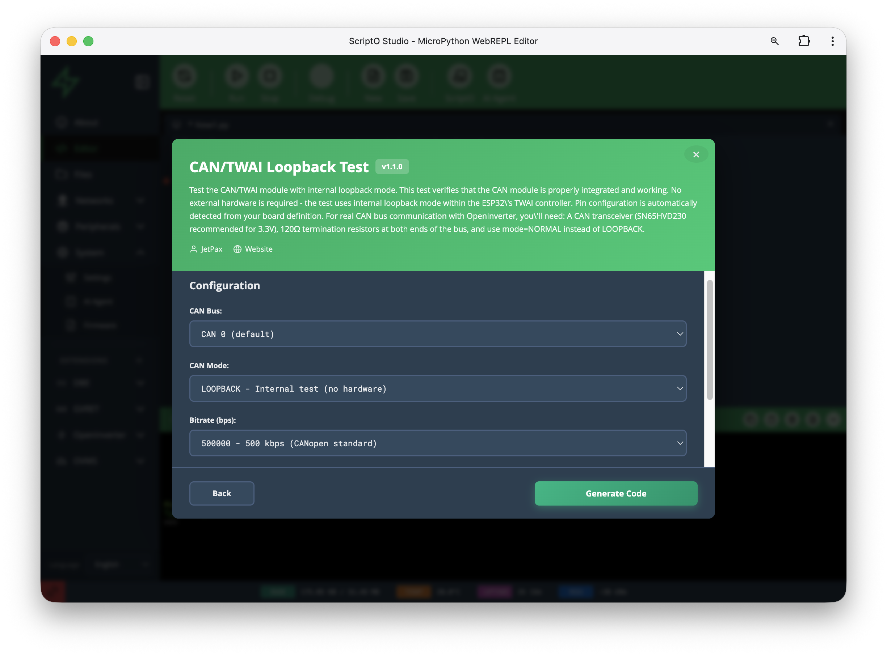

<h1 align="center">
 ⚡ ScriptO Studio
</h1>

<h4 align="center">
Program embedded devices with natural language. No firmware updates required.
</h4>
<p align="center">
  <a href="https://app.scriptostudio.com">
    
  </a>
</p>

ScriptO Studio is a next-generation Integrated Development and Execution Environment (IDEE) for embedded devices running MicroPython.

Delivered as a PWA that runs in any modern browser, ScriptO Studio communicates over a secure link to the device, providing a rich extensible UI that takes no processing power or resources on the device.

---

## ⚡ But Isn't Python Too Slow?

That's where **[pyDirect](https://github.com/jetpax/pyDirect)** comes in.

pyDirect provides C-native "fast path" acceleration for performance-critical operations. Python handles the application logic, while time-sensitive protocols run at native speed:

| Fast Path | What It Accelerates |
|-----------|---------------------|
| **CAN/GVRET** | 1Mbps CAN bus with SavvyCAN-compatible logging |
| **WebRTC** | Real-time P2P communication with NAT traversal |
| **HTTP/HTTPS** | TLS encryption and WebSocket protocols |
| **Husarnet VPN** | Zero-config global device connectivity |

Python makes it easy. Native code makes it fast. Best of both worlds.

---

## ✨ Key Features

### 🛡️ Fast, Secure Development
Real-time code execution and debugging with no firmware updates required. Works in all modern browsers, and on iOS and Android as a Progressive Web App.

### ✏️ Smart Python Editor


Agentic code editor for MicroPython with syntax highlighting, file management, and seamless deployment. Just describe what you want, and the AI agent does the rest.

### 🧩 ScriptO Automations


Script Objects are the ultimate device customization tool. Choose from a [library of ScriptOs](https://registry.scriptostudio.com/catalogue/) to get started, or create your own with the Smart Editor.

### 📦 System Extensions


Add major new features at the touch of a button. Load [Extensions](https://registry.scriptostudio.com/extensions-catalogue/) like **OVMS**, **OpenInverter**, **GVRET**, or **Dala's Battery Emulator**.

### ⚙️ Device Management


Connect and manage devices, configure board settings, manage files, and network settings. Access your devices from anywhere over a secure P2P VPN.

### 🐞 Visual Debugger
Advanced debugger with single-step execution and watchpoints. Live system monitoring and performance metrics.

---

## 📦 Registry

The registry provides a curated collection of reusable code:

### 🐍 ScriptOs (Python Scripts)
Python scripts that run directly on your ESP32 device — hardware drivers, protocol implementations, and utility libraries.

**Browse:** [registry.scriptostudio.com/catalogue/](https://registry.scriptostudio.com/catalogue/)

### 🔌 Extensions (JavaScript + Python)
Full-featured applications with rich UIs that extend ScriptO Studio's capabilities.

| Extension | Based On | Status |
|-----------|----------|--------|
| **GVRET** | [collin80/GVRET](https://github.com/collin80/GVRET) | ✅ Working |
| **OVMS** | [Open Vehicle Monitoring System](https://docs.openvehicles.com/) | 🚧 In development |
| **OpenInverter** | [openinverter.org](https://openinverter.org/) | 🚧 In development |
| **Battery Emulator** | [Dala's Battery Emulator](https://github.com/dalathegreat/Battery-Emulator) | 🚧 In development |

**Browse:** [registry.scriptostudio.com/extensions-catalogue/](https://registry.scriptostudio.com/extensions-catalogue/)

---

## 🚀 Quick Start

ScriptO Studio runs on any device that runs MicroPython with **[pyDirect](https://github.com/jetpax/pyDirect)** extensions installed. Currently ESP32-S3 and ESP32-P4 are supported, but MicroPython on ZephyrOS is in the pipeline, opening up a world of new devices, such as Raspberry Pi RP2350.

### 1. Flash pyDirect Firmware

<p align="center">
  <a href="https://jetpax.github.io/pyDirect/">
    
  </a>
</p>

Works directly in your browser. No software to install.

### 2. Open ScriptO Studio

Visit **[app.scriptostudio.com](https://app.scriptostudio.com)** — works on desktop, tablet, or phone.

### 3. Load an Extension

Click **Extensions** → Browse → **Install**. Your device is now running that application.

### 4. Disconnect and Go

Your device keeps running the Extension autonomously. Access its web UI directly, or remotely via VPN.

---

## 🌐 The Ecosystem

| Component | What It Does |
|-----------|--------------|
| **[ScriptO Studio](https://app.scriptostudio.com)** | Web IDE + Extension loader |
| **[pyDirect](https://github.com/jetpax/pyDirect)** | ESP32 firmware — fast-path C modules |
| **[Registry](https://registry.scriptostudio.com)** | Catalogue of Extensions and ScriptOs |
| **[WebREPL Binary Protocol](https://jetpax.github.io/webrepl/webrepl_binary_protocol_rfc.md)** | IANA-registered sub-protocol |

---

## 📱 Platform Support

**ScriptO Studio** runs in any modern browser:
- ✅ Chrome / Edge / Firefox / Safari
- ✅ iPad / iPhone / Android (installable PWA)

**Devices** running pyDirect:
- ✅ ESP32-S3 (primary)
- ✅ ESP32-P4
- 🔜 RP2350 / Zephyr

---
## 🏗️ Repository Structure

This repository hosts:

| Path | Description | URL |
|------|-------------|-----|
| `/app/` | ScriptO Studio IDE | [app.scriptostudio.com](https://app.scriptostudio.com) |
| `/registry/` | ScriptOs & Extensions catalogue | [registry.scriptostudio.com](https://registry.scriptostudio.com) |
| `/docs/` | Documentation | [docs.scriptostudio.com](https://docs.scriptostudio.com) |

---

## 🛠️ Development

### Contributing ScriptOs

ScriptOs are Python scripts with embedded metadata. To add one:

1. Create a `.py` file with a config block:
```python
# === START_CONFIG_PARAMETERS ===
dict(
    info = dict(
        name = 'My ScriptO',
        version = [1, 0, 0],
        author = 'Your Name',
        description = 'What it does',
        category = 'Sensors'
    )
)
# === END_CONFIG_PARAMETERS ===
```

2. Add to `registry/ScriptOs/`
3. Run `python3 tools/build_index.py` to regenerate the index

### Contributing Extensions

Extensions are JavaScript apps with optional device-side Python libraries:

```
registry/Extensions/MyExtension/
├── MyExtension.js      # UI code with config block
└── lib/                # Optional Python libraries for device
    └── my_module.py
```

See the [Contributing Guide](docs/CONTRIBUTING.md) for full details.

---

## 📄 License

MIT

---

**Made with ❤️ for the Embedded Python community**
