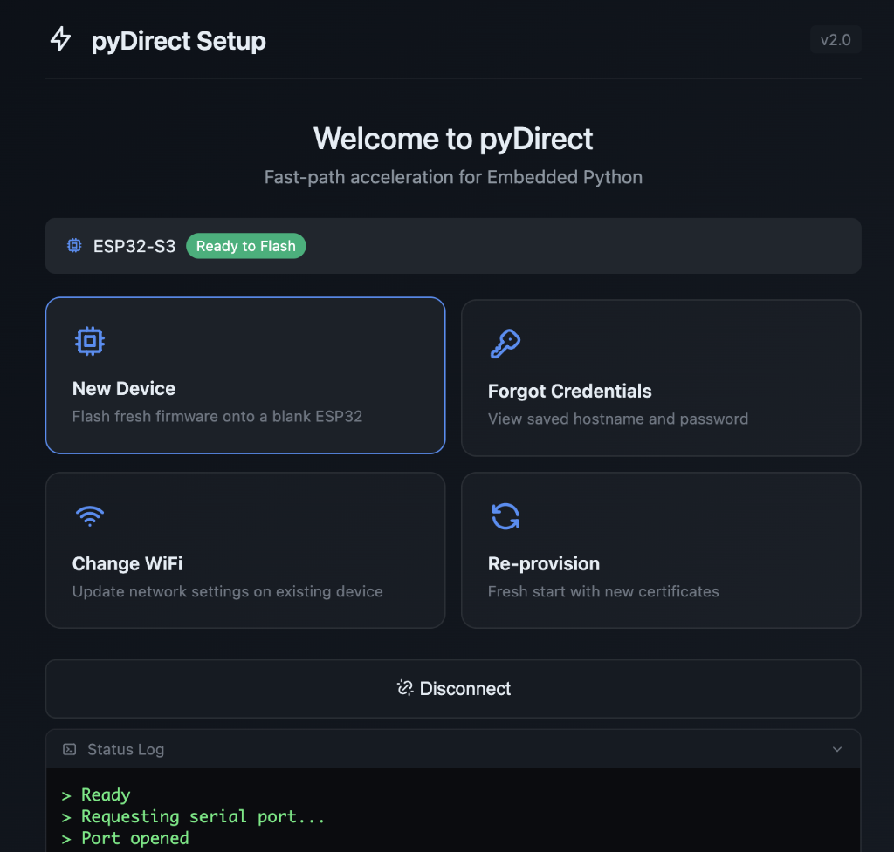

# Getting Started

Get started with ScriptO Studio and pyDirect.

## pyDirect Setup Tool

The **pyDirect Setup** tool at [pydirect.com](https://pydirect.com) provides a unified workflow for all device scenarios. Connect your ESP32 via USB and choose from four options:

| Scenario | Description |
|----------|-------------|
| **New Device** | Flash fresh firmware onto a blank ESP32 |
| **Forgot Credentials** | View saved hostname and password |
| **Change WiFi** | Update network settings on existing device |
| **Re-provision** | Fresh start with new certificates |

## New Device Setup

If you have a brand new ESP32 chip without firmware:

1. **Go to [pydirect.com](https://pydirect.com)**
2. Connect your ESP32 via USB
3. Click **Connect Device**
4. Select **New Device** when the chip is detected
5. Flash the firmware (automatically selected for your chip)
6. Configure WiFi when prompted
7. Device reboots and redirects you to the device's web interface
8. **Accept the browser security warning** (self-signed certificate) - click Advanced → Proceed
9. **Enter an access password** - this is stored on the device and used for all future connections
10. You'll be redirected to ScriptO Studio
11. When ScriptO Studio prompts for connection, **use the same password** you set in step 9

> [!IMPORTANT]
> The password you set during provisioning is used both for the device's local web interface AND for ScriptO Studio connections. Remember this password!

## Existing pyDirect Device

If you already have a device running pyDirect firmware:

1. **Go to [scriptostudio.com](https://scriptostudio.com)**
2. Click **Connect**
3. Enter your device's IP address or hostname (e.g. `pydirect-xxxx.local`)
4. Enter the access password (set during initial provisioning)
5. Click **Connect**

## Forgot Credentials

If you can't remember your device's hostname or password:

1. **Go to [pydirect.com](https://pydirect.com)**
2. Connect via USB and click **Connect Device**
3. Select **Forgot Credentials**
4. Your device's hostname, password, and WiFi SSID are displayed

## Change WiFi

To update network settings on an existing device:

1. **Go to [pydirect.com](https://pydirect.com)**
2. Connect via USB and click **Connect Device**
3. Select **Change WiFi**
4. Choose from the list of detected networks
5. Enter the WiFi password
6. Device connects to the new network and generates a new certificate

## Re-provision

For a complete fresh start with new certificates:

1. **Go to [pydirect.com](https://pydirect.com)**
2. Connect via USB and click **Connect Device**
3. Select **Re-provision**
4. Enter a new password when prompted
5. Device generates new certificates and restarts

## Connection Requirements

- **Browser**: Chrome, Edge, or Opera (WebSerial/WebRTC support required)
- **Device**: ESP32-S3 or ESP32-P4 with pyDirect firmware
- **Network**: Device and browser on same network for ScriptO Studio

## Accepting the Security Certificate

pyDirect devices use HTTPS with a self-signed certificate generated during setup. When you first connect:

1. Browser shows "Your connection is not private" warning
2. Click **Advanced** (or "Show Details" on Safari)
3. Click **Proceed to [device-hostname]** (or "visit this website")
4. The certificate is now trusted for this device

This only needs to be done once per device per browser.

## Next Steps

- **[First ScriptO](first-scripto.md)** - Run your first script
- **[IDE Overview](ide-overview.md)** - Learn the interface
- **[Troubleshooting Connection](../troubleshooting/connection.md)** - If you have issues

## Troubleshooting

**Can't connect from pydirect.com?**

- Check USB cable supports data (not charge-only)
- Install USB drivers if needed (CP210x or CH340)
- Put device in boot mode (hold BOOT, press RESET, release BOOT)

**Can't connect from scriptostudio.com?**

- Verify device is powered and on the network
- Check the IP address is correct
- Make sure you're using the password set during provisioning
- Accept the self-signed certificate warning first

See [Troubleshooting Connection](../troubleshooting/connection.md) for more help.
