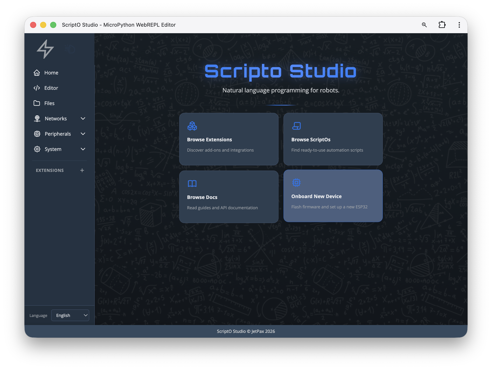

# Getting Started

Get started with ScriptO Studio.

## Onboard New Device

ScriptO Studio includes a built-in onboarding tool for all device scenarios. Click **Onboard New Device** from the home screen, connect your ESP32 via USB, and choose from four options:

| Scenario | Description |
|----------|-------------|
| **New Device** | Flash fresh firmware onto a blank ESP32 |
| **Forgot Credentials** | View saved hostname and password |
| **Change WiFi** | Update network settings on existing device |
| **Re-provision** | Generate new certificates for HTTPS |

## New Device Setup

If you have a brand new ESP32 chip without firmware:

1. **Go to [scriptostudio.com](https://scriptostudio.com)**
2. Click **Onboard New Device** from the home screen
3. Connect your ESP32 via USB
4. Click **Connect Device**
5. Select **New Device** when the chip is detected
6. Flash the firmware (automatically selected for your chip)
7. **Configure WiFi** when the network modal appears
   - Select your network from the list (shows signal strength in dBm)
   - Enter the WiFi password
   - Device connects and saves settings
   - You're returned to the scenarios screen
8. Select **Re-provision Device** to generate certificates
   - Certificate is generated and installed
   - Device resets and connects to WiFi
9. **Accept the security warning modal** and click to open device
10. **Accept the browser security warning** (click Advanced → Proceed)
11. **Set an access password** on the device's web interface
12. You'll be redirected to ScriptO Studio
13. When ScriptO Studio prompts for connection, **use the same password** you set in step 11

> [!IMPORTANT]
> The password you set during provisioning is used both for the device's local web interface AND for ScriptO Studio connections. Remember this password!

## Existing Device

If you already have a device running pyDirect enabled firmware:

1. **Go to [scriptostudio.com](https://scriptostudio.com)**
2. Click **Connect**
3. Enter your device's IP address or hostname (e.g. `pybot-xxxx.local`)
4. Enter the access password (set during initial provisioning)
5. Click **Connect**

## Forgot Credentials

If you can't remember your device's hostname or password:

1. **Go to [scriptostudio.com](https://scriptostudio.com)**
2. Click **Onboard New Device**
3. Connect via USB and click **Connect Device**
4. Select **Forgot Credentials**
5. Your device's hostname, password, and WiFi SSID are displayed

## Change WiFi

To update network settings on an existing device:

1. **Go to [scriptostudio.com](https://scriptostudio.com)**
2. Click **Onboard New Device**
3. Connect via USB and click **Connect Device**
4. Select **Change WiFi**
5. A modal shows available networks with signal strength (dBm)
6. Select your network and enter the WiFi password
7. Device connects and you're returned to scenarios

> [!NOTE]
> Change WiFi only updates network settings. If you need new HTTPS certificates, 
> select **Re-provision Device** afterward.

## Re-provision

To generate new HTTPS certificates:

1. **Go to [scriptostudio.com](https://scriptostudio.com)**
2. Click **Onboard New Device**
3. Connect via USB and click **Connect Device**
4. Select **Re-provision Device**
5. New certificate is generated and installed
6. Device resets and connects to WiFi
7. A modal explains the security warning you'll see
8. Click **Connect to [hostname]** to open device in new tab
9. Accept the browser security warning
10. Set a new password on the device's web interface

## Connection Requirements

- **Browser**: Chrome, Edge, or Opera (WebSerial/WebRTC support required)
- **Device**: ESP32-S3 or ESP32-P4 with pyDirect enabled firmware
- **Network**: Device and browser on same network for ScriptO Studio

## Accepting the Security Certificate

Devices use HTTPS with a self-signed certificate generated during setup. When you first connect:

1. Browser shows "Your connection is not private" warning
2. Click **Advanced** (or "Show Details" on Safari)
3. Click **Proceed to [device-hostname]** (or "visit this website")
4. The certificate is now trusted for this device

This only needs to be done once per device per browser.

## Next Steps

- **[First ScriptO](first-scripto.md)** - Run your first script
- **[IDE Overview](ide-overview.md)** - Learn the interface
- **[Troubleshooting Connection](../troubleshooting/connection.md)** - If you have issues

## Troubleshooting

**Can't connect via USB?**

- Check USB cable supports data (not charge-only)
- Install USB drivers if needed (CP210x or CH340)
- Put device in boot mode (hold BOOT, press RESET, release BOOT)

**Can't connect from scriptostudio.com?**

- Verify device is powered and on the network
- Check the IP address is correct
- Make sure you're using the password set during provisioning
- Accept the self-signed certificate warning first

See [Troubleshooting Connection](../troubleshooting/connection.md) for more help.
