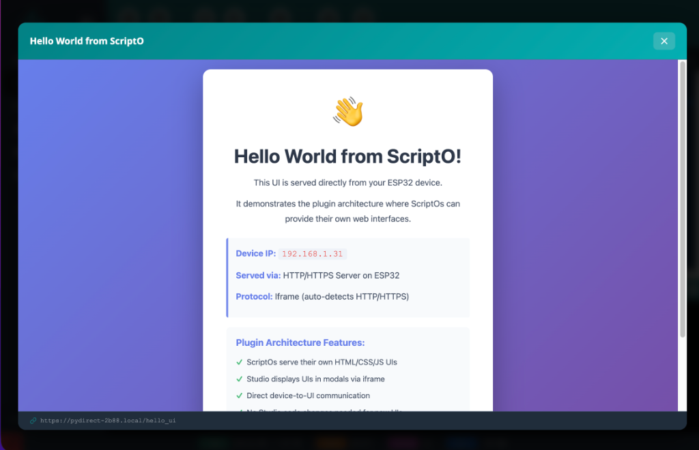

# UI Plugin - Hello World

A minimal demonstration of the ScriptO UI Plugin Architecture. This ScriptO registers an HTTP route on your device and displays a custom web interface in a modal window within ScriptO Studio.



## Features

- **Device-served UI** - HTML/CSS/JS served directly from your ESP32
- **Iframe integration** - Studio displays the UI in a modal
- **Zero Studio changes** - No code changes needed in ScriptO Studio
- **Full web capabilities** - Use any web technologies in your plugin UI

## How It Works

1. The ScriptO registers an HTTP route (`/hello_ui`) on the device
2. A `display_ui` command is sent to Studio via WebREPL
3. Studio opens an iframe modal pointing to the device's HTTP server
4. The UI is served directly from the ESP32

## Running the ScriptO

1. Connect to your device in ScriptO Studio
2. Open **ScriptOs** → **UI Plugins** → **UI Plugin - Hello World**
3. (Optional) Customize the window title in the configuration
4. Click **Run**
5. The Hello World UI appears in a modal window

## Configuration Parameters

| Parameter | Type | Default | Description |
|-----------|------|---------|-------------|
| `ui_title` | string | "Hello World from ScriptO" | Title shown in the modal window |

## Optional: Trust Device Certificate (macOS)

When running UI Plugins, Chrome may show a "Not Secure" warning in the URL bar because the device uses a self-signed HTTPS certificate. This is cosmetic and doesn't affect functionality, but you can eliminate it by trusting the device certificate:

1. In ScriptO Studio, open **Files** and navigate to `/certs/`
2. Download `servercert.pem` to your Mac
3. Double-click the `.pem` file → Opens Keychain Access
4. The certificate is added to your "login" keychain
5. Find the cert in Keychain Access, double-click it
6. Expand the **Trust** section
7. Set **"When using this certificate"** to **"Always Trust"**
8. Close the dialog (enter your password when prompted)
9. Restart Chrome

> [!NOTE]
> Each device has a unique self-signed certificate. You'll need to repeat this process for each device you want to permanently trust.

## Creating Your Own UI Plugin

Use this ScriptO as a template for creating your own UI plugins:

```python
import httpserver
import webrepl_binary as webrepl
import network
import json
from lib.sys.utils import getDeviceURL

def my_ui_handler(uri, post_data=None, remote_addr=None):
    """HTTP handler that returns your custom HTML."""
    html = """<!DOCTYPE html>
<html>
<head>
    <title>My Custom UI</title>
    <style>
        /* Your CSS here */
    </style>
</head>
<body>
    <h1>My Custom UI</h1>
    <!-- Your content here -->
    <script>
        // Your JavaScript here
    </script>
</body>
</html>"""
    httpserver.send(html)

# Register the HTTP route
httpserver.on('/my_ui', my_ui_handler, 'GET')

# Tell Studio to display the UI
url = getDeviceURL('/my_ui')
webrepl.notify(json.dumps({
    "display_ui": {
        "url": url,
        "title": "My Custom UI"
    }
}))
```

## Key Functions

| Function | Module | Purpose |
|----------|--------|---------|
| `httpserver.on(path, handler, method)` | `httpserver` | Register HTTP route |
| `httpserver.send(content)` | `httpserver` | Send HTTP response |
| `getDeviceURL(path)` | `lib.sys.utils` | Get device URL with correct protocol and hostname |
| `webrepl.notify(payload)` | `webrepl_binary` | Send command to Studio |

## Related

- [Writing Extensions](../extensions/writing-extensions.md) - Create full JS extensions with sidebar tabs
- [WebREPL Binary Protocol](../protocol/webrepl-binary-protocol.md) - Protocol details
